# FeelyAI

**Run advanced AI models directly in your browser. Private, secure, and purely local.**

FeelyAI is a powerful, privacy-focused AI chat application that runs entirely in your browser using WebLLM. No server costs, no data sent to external servers, and 100% client-side execution.



## ✨ Features

### 🔒 **100% Private & Local**
- All AI processing happens directly in your browser using WebGPU
- No data sent to external servers
- No API keys required
- Complete privacy and security

### 🤖 **Multiple AI Models**
Choose from several optimized language models:
- **Llama 3.2 3B** - Fast and efficient general-purpose model
- **Hermes 3 (Llama 3.1 8B)** - Advanced reasoning and tool use
- **TinyLlama 1.1B** - Ultra-lightweight for quick responses
- **Qwen2.5-Coder-3B** - Specialized for coding tasks

### 🛠️ **MCP (Model Context Protocol) Integration**
- Connect to MCP servers to extend AI capabilities
- Add custom tools and functions
- Support for custom headers and authentication
- Enable/disable servers on the fly
- Real-time tool discovery and schema introspection

### 🔧 **Built-in Tools**
FeelyAI includes powerful built-in tools:
- **`evalCode`** - Execute JavaScript code directly in the browser (with safe eval mode)
- **`listTools`** - Discover available tools with search and regex filtering
- **`getToolSchema`** - Inspect tool schemas before use

### 🎯 **Smart Tool Execution**
- **Schema Discovery Pattern** - AI automatically discovers and learns tool schemas
- **Validation & Error Handling** - Automatic validation with helpful error messages
- **Permission System** - Granular control over tool execution
  - Allow once
  - Allow for session
  - Always allow
- **Safe Eval Mode** - Run code in isolated Web Workers for security

### 💬 **Advanced Chat Management**
- **Projects & Chats** - Organize conversations into projects
- **Persistent Storage** - All chats saved locally using IndexedDB
- **Auto-titling** - Chats automatically named from first message
- **Message History** - Full conversation history with tool calls and outputs
- **Markdown Support** - Rich text rendering with syntax highlighting

### ⚙️ **Customizable System Prompts**
- Edit system instructions to customize AI behavior
- Template variables for dynamic tool injection (`{{listTools}}`, `{{tool_names}}`)
- Reset to defaults anytime
- Persistent across sessions

### 🎨 **Modern UI/UX**
- Clean, dark-themed interface
- Real-time progress indicators during model loading
- Collapsible tool outputs for better readability
- Responsive design
- Smooth animations and transitions

### 🔄 **Model Switching**
- Switch between models on the fly
- Automatic model download and caching
- Progress tracking during model initialization

## 🚀 Getting Started

### Prerequisites
- Modern browser with WebGPU support (Chrome 113+, Edge 113+)
- Sufficient RAM (4GB+ recommended)
- GPU with WebGPU support

### Installation

1. Clone the repository:
```bash
git clone https://github.com/hasmcp/feelyai.git
cd feelyai
```

2. Install dependencies:
```bash
npm install
```

3. Run the development server:
```bash
npm run dev
```

4. Open your browser and navigate to `http://localhost:5173`

### Building for Production

```bash
npm run build
npm run preview
```

## 🔌 Adding MCP Servers

1. Click the **"Add Server"** button in the sidebar
2. Enter the MCP server URL (e.g., `http://localhost:3000/mcp`)
3. Optionally add a name and custom headers
4. Click **"Add Server"**

The AI will automatically discover available tools from connected servers.

## 🛡️ Security Features

### Safe Eval Mode
When enabled (recommended), JavaScript code execution happens in an isolated Web Worker, preventing access to:
- DOM manipulation
- Local storage
- Cookies
- Parent window context

### Permission System
Control which tools the AI can execute:
- **Allow Once** - Single execution approval
- **Allow for Session** - Approve for current session
- **Always Allow** - Trust tool permanently

## 📦 Tech Stack

- **Frontend Framework**: Vue 3 (Composition API)
- **Build Tool**: Vite
- **AI Engine**: [@mlc-ai/web-llm](https://github.com/mlc-ai/web-llm)
- **MCP Client**: [@modelcontextprotocol/sdk](https://github.com/modelcontextprotocol)
- **Styling**: TailwindCSS 4
- **Icons**: Lucide Vue
- **Markdown**: markdown-it
- **Storage**: IndexedDB (via idb)
- **Validation**: Ajv (JSON Schema)

## 🏗️ Architecture

```
src/
├── components/
│   ├── AddServerModal.vue    # MCP server configuration
│   ├── ProjectSidebar.vue     # Project/chat navigation
│   └── McpIcon.vue            # MCP branding
├── composables/
│   └── useChat.js             # Main chat logic & state
├── services/
│   ├── McpClient.js           # MCP protocol client
│   └── MessageStore.js        # IndexedDB persistence
├── workers/
│   ├── llm.worker.js          # WebLLM worker
│   └── eval.worker.js         # Safe code execution
└── App.vue                    # Main application
```

## 🤝 Contributing

Contributions are welcome! Please feel free to submit a Pull Request.

## Created by

[HasMCP](https://hasmcp.com) - No-code/low-code MCP server framework with built-in auth, realtime logs and telemetry

## 📄 License

This project is licensed under the Apache License 2.0 - see the [LICENSE](LICENSE) file for details.

## 🙏 Acknowledgments

- [WebLLM](https://github.com/mlc-ai/web-llm) - Browser-based LLM inference
- [Model Context Protocol](https://modelcontextprotocol.io/) - Tool integration standard
- [MLC AI](https://mlc.ai/) - Machine Learning Compilation

## 🔗 Links

- [WebLLM Documentation](https://webllm.mlc.ai/)
- [MCP Specification](https://spec.modelcontextprotocol.io/)
- [Report Issues](https://github.com/hasmcp/feelyai/issues)


---

## ⚠️ Disclaimer

Usage of LLM models is subject to their respective license agreements. Please review the license terms for each model you use. FeelyAI is provided as-is, and AI-generated content may contain errors or inaccuracies.

---

**Powered by WebLLM • No Server Costs • 100% Client-Side**
